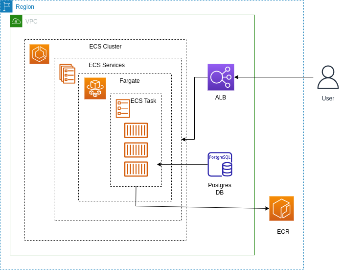

**Amazon Elastic Container Service (Amazon ECS)** is a fully managed container orchestration service that helps you easily deploy, manage, and scale containerized applications.

**AWS Fargate** is a technology that you can use with Amazon ECS to run containers without having to manage servers or clusters of Amazon EC2 instances.

Components:
1. An Amazon ECS _cluster_ is a logical grouping of tasks or services.
2. A _task definition_ is a text file that describes one or more containers that form your application.
3. A _task_ is the instantiation of a task definition within a cluster.
4. You can use an Amazon ECS _service_ to run and maintain your desired number of tasks simultaneously in an Amazon ECS cluster.

**Amazon Elastic Container Registry (Amazon ECR)** is an AWS managed container image registry service that is secure, scalable, and reliable. 

**Elastic Load Balancing** automatically distributes your incoming traffic across multiple targets, such as EC2 instances, containers, and IP addresses, in one or more Availability Zones. It monitors the health of its registered targets, and routes traffic only to the healthy targets. 

**Amazon Relational Database Service (Amazon RDS)** is a web service that makes it easier to set up, operate, and scale a relational database in the AWS Cloud. It provides cost-efficient, resizable capacity for an industry-standard relational database and manages common database administration tasks.

**Infrastructure**

This terraform code creates ECS cluster managed by Fargate, Relational Database Readis which communicates with containers through 8000 port, Application Load Balancer to distribute traffic across containers. 

The diagram below shows the infrastructure:



**To create infrastructure:**

1. Initialize a working directory containing Terraform configuration files

```
terraform init
```
2. Create an infrastructure
   
```
terraform apply
```

**To destroy:**

```
terraform destroy
```
